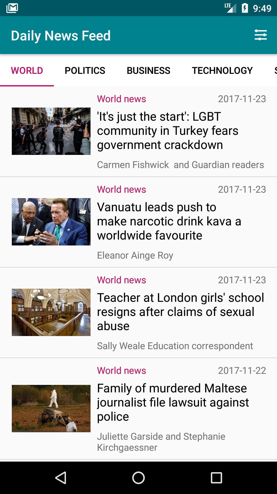
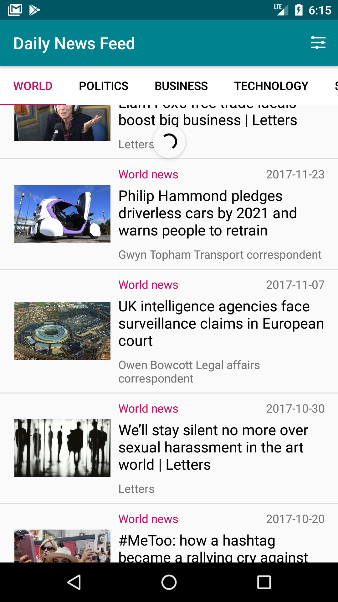
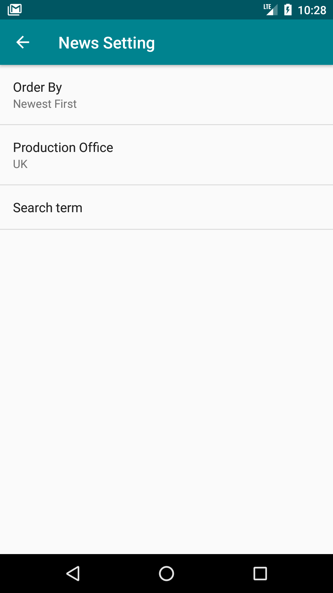
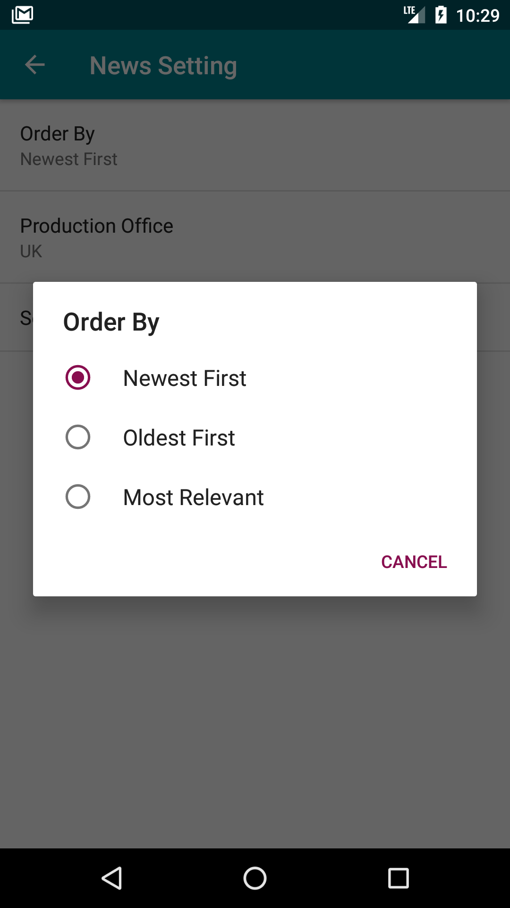
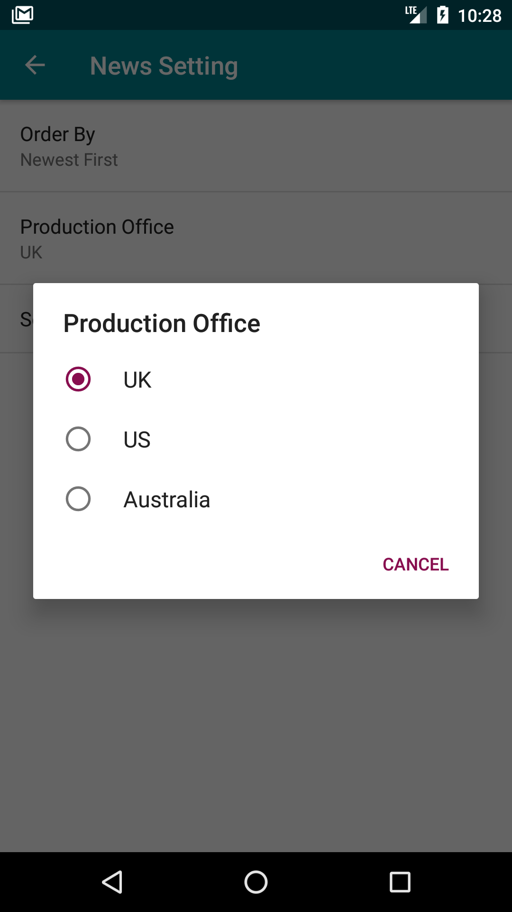
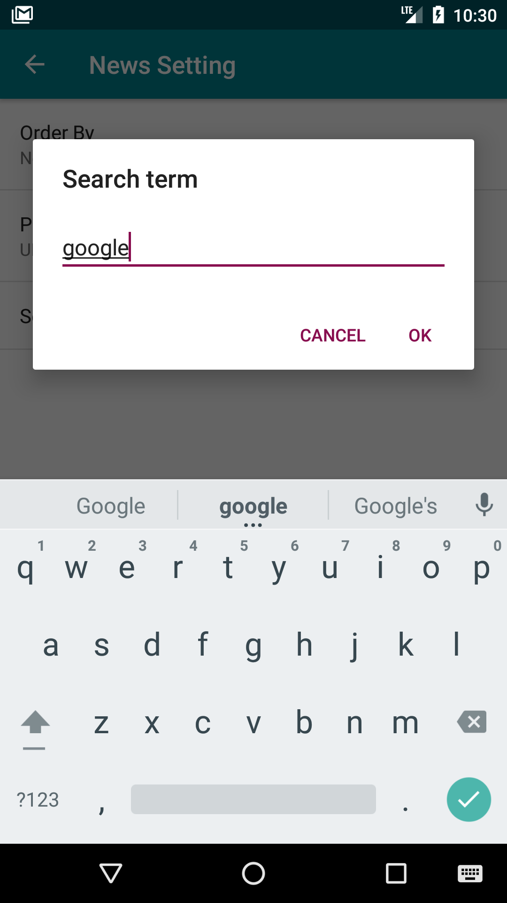
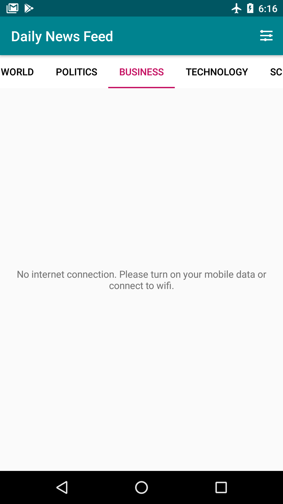

# DailyNewsFeed App

News feed app written for Udacity Android Basics by Google Nanodegree Program

## Project Background

The goal is to create a News feed app which gives a user regularly-updated news from the internet related to a particular topic, person, or location. Guardian
API is used to fetch results and display them to the user. This Project
combines various ideas and skills including:

- Connecting to an API
- Parsing the response of the API
- Handling error cases gracefully
- Updating information regularly
- Doing network operations independent of the Activity lifecycle

## Screenshots
On the main screen, multiple new stories are displayed. Main screen contains scrolling tab layout which enables user to swipe between different new categories. The app queries the content.guardianapis.com api to fetch news stories for each category Networking operations are done using a Loader. Clicking on a story opens the story in the user’s browser.

When user drag down the screen, the news feed will refresh and update with new news.

User can press on setting icon on top right corner of the screen to get to setting.

If no internet connect, app shows text to inform user to connect to internet.

